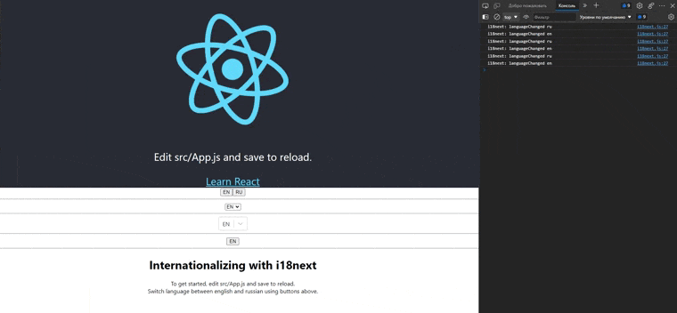

# react-i18next-test

   

***[react-i18next-test](https://psg-i18next-test.netlify.app)*** - it is a test application for learning how to use internationalization-framework **[I18next](https://www.i18next.com/)**
## Project creation
___
First, let's deploy a new React-project using the command:
```javascript
npx create-react-app my-app
or
yarn create react-app my-app
```
Now you need to install the dependencies for i18next to work correctly. Go to the project directory with the command:
```javascript
cd my-app
```
Run the following command in the project directory:
```javascript
npm i react-i18next i18next i18next-http-backend i18next-browser-languagedetector
or
yarn add react-i18next i18next i18next-http-backend i18next-browser-languagedetector
```
All preparatory work is done. Internationalization can be added.
## i18next configuration
___
First, let's create a configuration file ```i18n.js```. Put it next to root file ```index.js```

```i18n.js```
```javascript
import i18n from 'i18next';
import Backend from 'i18next-http-backend';
import LanguageDetector from 'i18next-browser-languagedetector';
import { initReactI18next } from 'react-i18next';

i18n
  // Connecting the backend i18next
  .use(Backend)
  // Automatic language detection
  .use(LanguageDetector)
  // Initialization module
  .use(initReactI18next)
  .init({
    // Standard language
    fallbackLng: 'en',
    debug: true,
    // Recognition and caching of language cookies
    detection: {
      order: ['queryString', 'cookie'],
      cache: ['cookie'],
    },
    interpolation: {
      escapeValue: false,
    },
  });

export default i18n;
```
Here, the necessary hooks are activated and the plugin settings are set: the base language, working with cookies, etc.

Now let's import the configuration file in ```index.js```
```index.js```

```javascript
import React, { Suspense } from 'react';
import ReactDOM from 'react-dom';
import './index.css';
import App from './App';
// plugin settings
import './i18n';

ReactDOM.render(
  <React.StrictMode>
    <Suspense fallback={<div>Loading...</div>}>
      <App />
    </Suspense>
  </React.StrictMode>,
  document.getElementById('root'),
);
```
The react i18next plugin is enabled and ready to use. The next step is to connect the necessary languages.
## Connecting locales
___
Internationalization on the web is usually based on json files, in which each word/word combination has its own translation. In our test application, we will work with English and Russian languages.

In the ```/public``` directory, you need to add a new locales folder. Each language will have its own subfolder: ```/en``` and ```/ru``` - in each of them the json-file ```translation.json``` with translations.

File for English:
```/publiclocales/en/translation.json```
```javascript
{
  "title": "Internationalizing with i18next",
  "description": {
    "part1": "To get started, edit src/App.js and save to reload.",
    "part2": "Switch language between english and russian using buttons above."
  },
  "link": "Learn React",
  "headline": "Edit src/App.js and save to reload."
}
```
File for Russian:

```locales/ru/translation.json```
```javascript
{
  "title": "Интернационализация с i18next",
  "description": {
    "part1": "Чтобы начать работу, отредактируйте и сохраните файл src/App.js.",
    "part2": "С помощью кнопок переключайте язык между английским и русским."
  },
  "link": "Изучите React",
  "headline": "Отредактируйте src/App.js и сохраните, чтобы перезагрузить."
}
```
Now let's display the information on the application's home page.

## Setting App.js
___
Open the ```App.js``` file and replace its auto-generated contents with the following:
```App.js```
```javascript
import React, { useState, useEffect } from 'react';
import { useTranslation } from 'react-i18next';
import logo from './logo.svg';
import './App.css';

function App() {
  const { t, i18n } = useTranslation();
  const changeLanguage = language => {
    i18n.changeLanguage(language);
  };

  return (
    <div className="App">
      <header className="App-header">
        
        <p>{t('headline')}</p>
        <a
          className="App-link"
          href="https://reactjs.org"
          target="_blank"
          rel="noopener noreferrer"
        >
          {t('link')}
        </a>
      </header>
      <button onClick={() => changeLanguage('en')}>EN</button>
      <button onClick={() => changeLanguage('ru')}>RU</button>
      <hr />
      <div>
        <h1>{t('title')}</h1>
      </div>
      <div>{t('description.part1')}</div>
      <div>{t('description.part2')}</div>
    </div>
  );
}

export default App;
```
Let's take a look at what's happening here.
### Hook useTranslation
We import the ```useTranslation``` hook of the ```i18next``` plugin:
```javascript
import { useTranslation } from 'react-i18next';
```
and connect it in the application code:
```javascript
const { t, i18n } = useTranslation();
```
Using the `t` function, the plugin will include translations and track changes in the current language.
### Content output
Now you just need to call this function at the right place, passing it the identifier from the locale file, for example:
```javascript
<p>{t('headline')}</p>
        <a
          className="App-link"
          href="https://reactjs.org"
          target="_blank"
          rel="noopener noreferrer"
        >
          {t('link')}
        </a>
```
or
```javascript
<div>
    <h1>{t('title')}</h1>
</div>
<div>{t('description.part1')}</div>
<div>{t('description.part2')}</div>
```
It is also necessary to add two more buttons for real-time language switching:
```javascript
<>
<button onClick={() => changeLanguage('en')}>EN</button>
<button onClick={() => changeLanguage('ru')}>RU</button>
<>
```
### Internationalization in action
On starting project:
 ```
npm start
or
yarn start
```
If you did everything right, then the magic should happen - the translation is done right while the application is running.


## Happy hacking!

